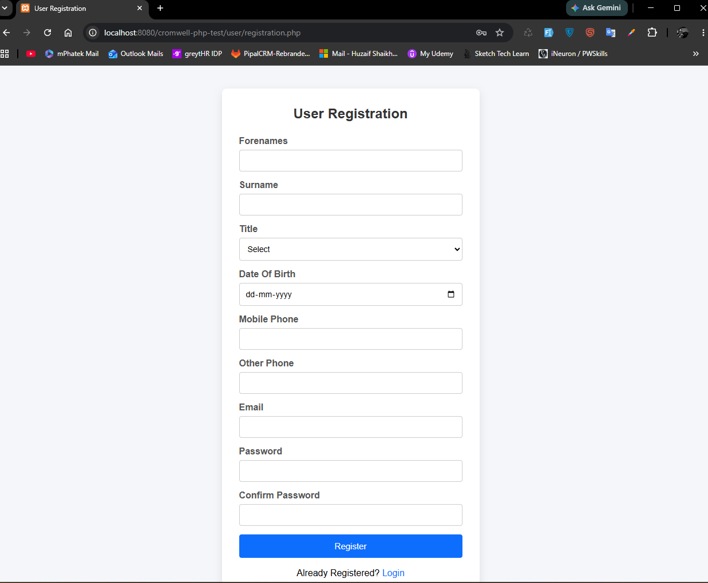
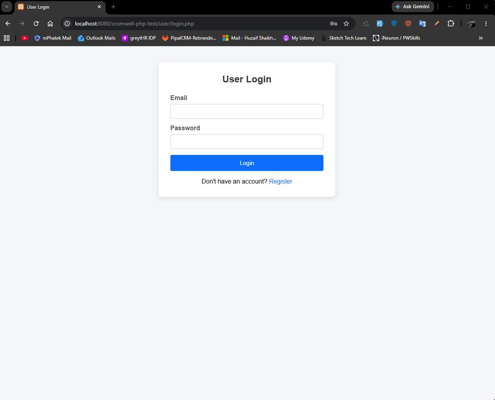
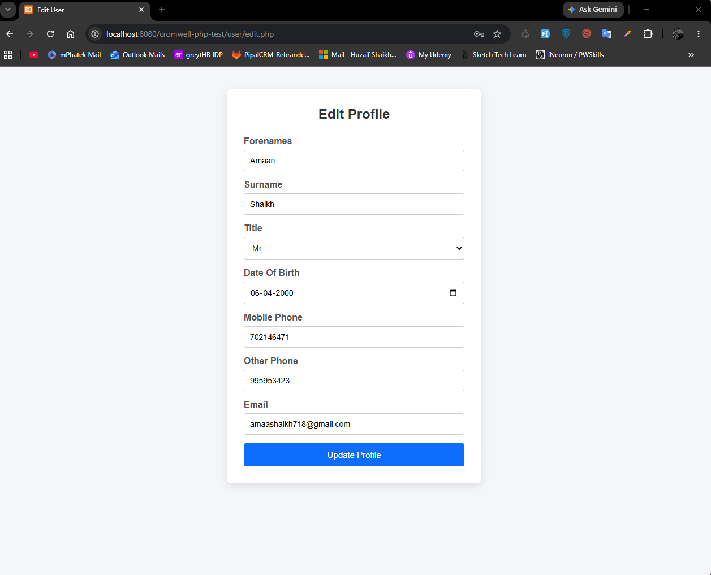
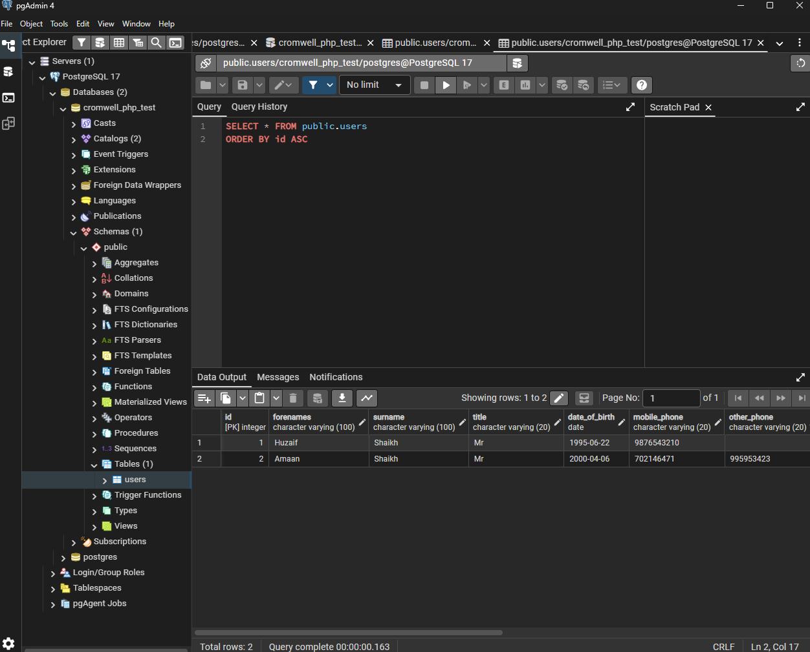

# Cromwell PHP Technical Assessment

A lightweight **User Management System** developed as part of the **Cromwell PHP Technical Assessment**.

The application provides REST APIs and a simple web interface for user registration, authentication, and profile management using **PHP**, **PostgreSQL**, and **Vanilla JavaScript**. The project follows a layered architecture consisting of **Controllers**, **Services**, **Models**, and **Helpers** to keep the code modular and maintainable.

---

# Features

## Mandatory Features

- ✅ User Registration REST API
- ✅ User Login REST API
- ✅ User Registration Web Interface
- ✅ User Login Web Interface

## Bonus Features

- ✅ Get User Details REST API
- ✅ Update User Details REST API
- ✅ Edit User Web Interface

---

# Technology Stack

| Technology | Version |
|------------|----------|
| PHP | 7.4.x |
| PostgreSQL | 17 |
| HTML5 | ✓ |
| CSS3 | ✓ |
| JavaScript (Vanilla JS) | ✓ |
| PDO | ✓ |

---

# Project Architecture

```
                Browser (Web UI)
                       │
                       ▼
                REST API Endpoints
                       │
                       ▼
                Controller Layer
                       │
                       ▼
                 Service Layer
                       │
                       ▼
                  Model Layer
                       │
                       ▼
               PostgreSQL Database
```

---

# Project Structure

```
cromwell-php-test
│
├── api
│
├── assets
│
├── config
│
├── controllers
│
├── helpers
│
├── models
│
├── services
│
├── sql
│
├── screenshots
│
├── user
│
├── test_connection.php
├── test_response.php
│
└── README.md
```
---

# Developer Utilities

The project includes two small utility scripts to simplify local development and troubleshooting.

| File | Purpose |
|------|---------|
| `test_connection.php` | Verifies that the application can successfully establish a connection to the PostgreSQL database using the configured database credentials. A success message confirms that the database configuration is correct. |
| `test_response.php` | Tests the common JSON response helper to verify that API responses are generated in the expected format before testing the REST endpoints. |

These files are intended for **development and debugging purposes only** and are **not required** for the normal operation of the application.

Example usage:

### Test Database Connection

```
http://localhost/cromwell-php-test/test_connection.php
```

Expected Output

```
✅ PostgreSQL Connected Successfully!
```

### Test API Response Helper

```
http://localhost/cromwell-php-test/test_response.php
```

Expected Output

```json
{
    "success": true,
    "message": "Everything is working!",
    "data": []
}
```

---

---

# Design Decisions

- Implemented a layered architecture using **Controller → Service → Model**.
- Used **PDO Prepared Statements** to prevent SQL Injection.
- Passwords are securely stored using **password_hash()** and verified using **password_verify()**.
- The Web UI communicates only with the REST APIs and never accesses the database directly.
- PostgreSQL is used as the backend database.

---

# Installation

## 1. Clone or Download

Clone the repository

```bash
git clone <repository-url>
```

or copy the project folder into

```
xampp/htdocs/cromwell-php-test
```

---

## 2. Create PostgreSQL Database

Create a database named

```sql
cromwell_php_test
```

---

## 3. Import SQL Script

Execute

```
sql/create_tables.sql
```

using pgAdmin or psql.

---

## 4. Configure Database

Open

```
config/config.php
```

Update the following values if required.

```php
Host
Port
Database
Username
Password
```

---

## 5. Start Services

Ensure the following services are running:

- Apache
- PostgreSQL

---

# Application URLs

## Registration

```
http://localhost/cromwell-php-test/user/registration.php
```

---

## Login

```
http://localhost/cromwell-php-test/user/login.php
```

---

## Edit User

```
http://localhost/cromwell-php-test/user/edit.php
```

---

# REST API Endpoints

| Method | Endpoint | Description |
|----------|-----------------|----------------|
| POST | `/api/user.php` | Register User |
| POST | `/api/login.php` | Login User |
| GET | `/api/user.php?id={id}` | Get User Details |
| PUT | `/api/user.php` | Update User Details |

---

# API Response Format

## Success

```json
{
    "success": true,
    "message": "Operation completed successfully.",
    "data": {}
}
```

## Error

```json
{
    "success": false,
    "message": "Validation failed.",
    "errors": {}
}
```

---

# Database

Database Name

```
cromwell_php_test
```

Main Table

```
users
```

Database Engine

```
PostgreSQL 17
```

---

# Security

The application implements:

- Password hashing using `password_hash()`
- Password verification using `password_verify()`
- Prepared Statements (PDO)
- SQL Injection prevention
- Server-side validation
- Basic Client-side validation

---

# Completed Requirements

- [x] Registration REST API
- [x] Login REST API
- [x] Registration Web UI
- [x] Login Web UI
- [x] Get User API (Bonus)
- [x] Update User API (Bonus)
- [x] Edit User Web UI (Bonus)
- [x] PostgreSQL Integration

---

# Screenshots

## Registration Page



---

## Login Page



---

## Edit User Page



---

## PostgreSQL Database



---

# Assumptions

- PHP 7.4 or above is installed.
- PostgreSQL is installed and running.
- Apache is configured through XAMPP.
- PostgreSQL uses the default port (5432).
- The project is hosted inside the XAMPP `htdocs` directory.

---

# Future Improvements

- JWT Authentication
- PHP Session Authentication
- CSRF Protection
- Email Verification
- Password Reset
- API Versioning
- Unit Testing (PHPUnit)
- Docker Support
- Logging
- Pagination & Filtering

---

# Author

**Huzaif Shaikh**

PHP Full Stack Developer

---

## Thank You

Thank you for taking the time to review my submission.

I enjoyed working on this technical assessment and hope it demonstrates my approach to writing clean, maintainable, and secure PHP applications using REST APIs and PostgreSQL.